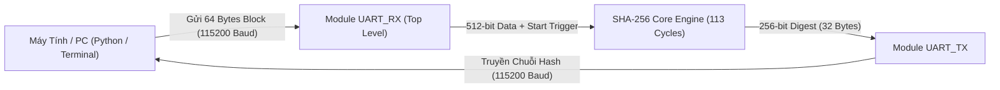
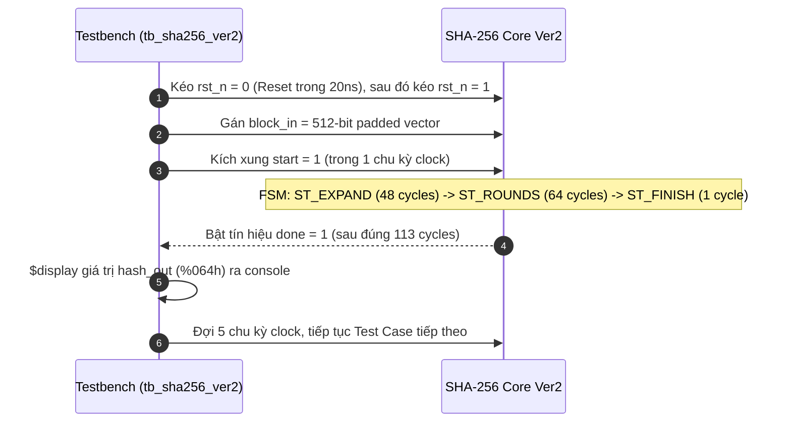
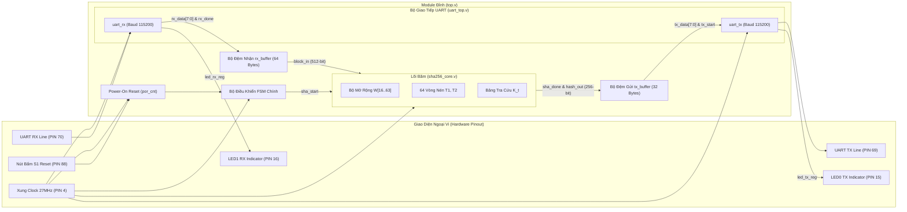
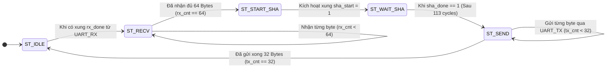

# Triển Khai Phần Cứng Thuật Toán Băm SHA-256 Trên FPGA (Verilog HDL)

[](https://www.gowinsemi.com/)
[]()
[]()
[](https://csrc.nist.gov/publications/detail/fips/180/4/final)
[]()

---

## 📑 Mục Lục
1. [Tổng Quan Dự Án](#1-tổng-quan-dự-án)
2. [Lý Thuyết Thuật Toán SHA-256 Chuẩn NIST FIPS 180-4](#2-lý-thuyết-thuật-toán-sha-256-chuẩn-nist-fips-180-4)
3. [Cấu Trúc Cây Thư Mục Dự Án](#3-cấu-trúc-cây-thư-mục-dự-án)
4. [So Sánh Chi Tiết Kiến Trúc SHA-256 Core: Version 1 vs Version 2](#4-so-sánh-chi-tiết-kiến-trúc-sha-256-core-version-1-vs-version-2)
5. [Mô Tả Chi Tiết Từng File Trong Mã Nguồn](#5-mô-tả-chi-tiết-từng-file-trong-mã-nguồn)
   - [5.1. Nhóm Module Triển Khai Trên KIT (sha256_implement)](#51-nhóm-module-triển-khai-trên-kit-sha256_implement)
   - [5.2. Nhóm Module Kiểm Thử Mô Phỏng (testbench)](#52-nhóm-module-kiểm-thử-mô-phỏng-testbench)
6. [Chi Tiết Phần Testbench & Kịch Bản Kiểm Thử](#6-chi-tiết-phần-testbench--kịch-bản-kiểm-thử)
   - [6.1. Testbench Ver1 (tb_sha256.v)](#61-testbench-ver1-tb_sha256v)
   - [6.2. Testbench Ver2 Nâng Cao (tb_sha256_ver2.v)](#62-testbench-ver2-nâng-cao-tb_sha256_ver2v)
   - [6.3. Test ROM Module (test_read_ROM.v)](#63-test-rom-module-test_read_romv)
   - [6.4. Bảng Kết Quả Kiểm Thử Test Vectors Thực Tế](#64-bảng-kết-quả-kiểm-thử-test-vectors-thực-tế)
7. [Thiết Kế & Triển Khai Thực Tế Trên Kit FPGA (Gowin GW2A-18C)](#7-thiết-kế--triển-khai-thực-tế-trên-kit-fpga-gowin-gw2a-18c)
   - [7.1. Sơ Đồ Khối Toàn Cục Hệ Thống (Top-Level Architecture)](#71-sơ-đồ-khối-toàn-cục-hệ-thống-top-level-architecture)
   - [7.2. Bộ Điều Khiển FSM Top-Level](#72-bộ-điều-khiển-fsm-top-level)
   - [7.3. Giao Thức Giao Tiếp UART (Baudrate 115200 @ 27MHz)](#73-giao-thức-giao-tiếp-uart-baudrate-115200--27mhz)
   - [7.4. Sơ Đồ Gán Chân I/O Phím Bấm & LED Chỉ Báo (pin_out.cst)](#74-sơ-đồ-gán-chân-io-phím-bấm--led-chỉ-báo-pin_outcst)
8. [Quy Trình Biên Dịch, Nạp Bitstream & Kiểm Thử Phần Cứng](#8-quy-trình-biên-dịch-nạp-bitstream--kiểm-thử-phần-cứng)
   - [8.1. Hướng Dẫn Biên Dịch Bằng Gowin EDA](#81-hướng-dẫn-biên-dịch-bằng-gowin-eda)
   - [8.2. Kịch Bản Giao Tiếp Python & Terminal](#82-kịch-bản-giao-tiếp-python--terminal)
9. [Báo Cáo Tài Nguyên Sử Dụng & Đánh Giá Hiệu Năng](#9-báo-cáo-tài-nguyên-sử-dụng--đánh-giá-hiệu-năng)
10. [Kết Luận & Hướng Phát Triển](#10-kết-luận--hướng-phát-triển)

---

## 1. Tổng Quan Dự Án

Dự án **FPGA_VERILOG_PROJECT** hiện thực hóa thuật toán băm mật mã an toàn **SHA-256 (Secure Hash Algorithm 256-bit)** hoàn toàn bằng phần cứng RTL (Register-Transfer Level) trên chip FPGA **Gowin GW2A-18C** (Package: `GW2A-LV18QN88C8/I7`).

Khác với các triển khai phần mềm phụ thuộc vào chu kỳ xử lý của CPU tuần tự, kiến trúc phần cứng này tận dụng triệt để:
- **Xử lý song song bitwise**: Các hàm dịch, xoay vòng (`ROTR`, `SHR`), logic bool (`Ch`, `Maj`) thực hiện trong 1 mức logic tổ hợp (combinational logic).
- **Pipeline và lập lịch nén tối ưu (Schedule Optimization)**: Giảm chu kỳ tính toán một khối 512-bit từ hơn 400 chu kỳ (ở phiên bản Ver1) xuống còn đúng **113 chu kỳ xung nhịp** (ở phiên bản Ver2).
- **Giao tiếp UART tích hợp đầy đủ (Full-Duplex)**: Cho phép kết nối trực tiếp với máy tính (PC) qua cổng COM ảo, nhận 64 Byte dữ liệu (512-bit), tính toán tức thời và truyền ngược lại 32 Byte (256-bit) mã băm SHA-256 Digest chuẩn.



---

## 2. Lý Thuyết Thuật Toán SHA-256 Chuẩn NIST FIPS 180-4

Thuật toán SHA-256 nhận đầu vào là thông điệp có độ dài bất kỳ $L < 2^{64}$ bit và sinh ra mã băm có độ dài cố định là **256 bit (32 bytes)**. Quá trình xử lý diễn ra qua 4 bước cơ bản:

```mermaid
flowchart LR
    subgraph S1["1. Tiền Xử Lý (Pre-processing)"]
        D1["Message M"] --> D2["Padding 1 bit '1'"] --> D3["Padding k bit '0'"] --> D4["Gán 64-bit Length"] --> D5["Khối N x 512-bit"]
    end
    subgraph S2["2. Mở Rộng Từ Khóa (Expansion)"]
        D5 --> W1["16 Word W[0..15]"] --> W2["Tính W[16..63] qua σ0, σ1"]
    end
    subgraph S3["3. Nén 64 Vòng (Compression)"]
        W2 --> R0["Nạp a..h = H[0..7]"] --> R1["Vòng 0..63 với K[t], W[t]"]
    end
    subgraph S4["4. Cập Nhật Digest (Accumulator)"]
        R1 --> H0["H[i] = H[i] + Reg[i]"] --> OUT["Hash Output 256-bit"]
    end
```



### 2.1. Đệm Dữ Liệu (Message Padding)
Một khối dữ liệu chuẩn đầu vào của SHA-256 phải là bội số của **512 bit**:
1. Nối thêm bit `1` vào cuối thông điệp gốc.
2. Nối thêm $k$ bit `0` sao cho tổng chiều dài: $(L + 1 + k) \equiv 448 \pmod{512}$.
3. Nối thêm 64-bit biểu diễn độ dài $L$ của thông điệp gốc dưới dạng Big-Endian integer.

### 2.2. Giá Trị Khởi Tạo $H^{(0)}$ & Hằng Số Vòng $K_t$
- **8 thanh ghi trạng thái ban đầu $H_0 \dots H_7$**: Lấy từ phần phân thập phân của căn bậc hai của 8 số nguyên tố đầu tiên (2, 3, 5, 7, 11, 13, 17, 19):
  $$\begin{aligned}
  H_0 &= \mathtt{32'h6a09e667}, & H_1 &= \mathtt{32'hbb67ae85}, & H_2 &= \mathtt{32'h3c6ef372}, & H_3 &= \mathtt{32'ha54ff53a} \\
  H_4 &= \mathtt{32'h510e527f}, & H_5 &= \mathtt{32'h9b05688c}, & H_6 &= \mathtt{32'h1f83d9ab}, & H_7 &= \mathtt{32'h5be0cd19}
  \end{aligned}$$
- **64 hằng số vòng $K_0 \dots K_{63}$**: Lấy từ phần phân thập phân của căn bậc ba của 64 số nguyên tố đầu tiên.

### 2.3. Các Phép Toán Cơ Bản & Hàm Logic (Functions)
Các hàm biến đổi bit phi tuyến được định nghĩa như sau:

$$\begin{aligned}
\text{Ch}(x, y, z) &= (x \wedge y) \oplus (\neg x \wedge z) \\
\text{Maj}(x, y, z) &= (x \wedge y) \oplus (x \wedge z) \oplus (y \wedge z) \\
\Sigma_0(x) &= \text{ROTR}^2(x) \oplus \text{ROTR}^{13}(x) \oplus \text{ROTR}^{22}(x) \\
\Sigma_1(x) &= \text{ROTR}^6(x) \oplus \text{ROTR}^{11}(x) \oplus \text{ROTR}^{25}(x) \\
\sigma_0(x) &= \text{ROTR}^7(x) \oplus \text{ROTR}^{18}(x) \oplus \text{SHR}^3(x) \\
\sigma_1(x) &= \text{ROTR}^{17}(x) \oplus \text{ROTR}^{19}(x) \oplus \text{SHR}^{10}(x)
\end{aligned}$$

*Trong đó $\text{ROTR}^n(x)$ là phép xoay phải $n$ bit, $\text{SHR}^n(x)$ là dịch phải logic $n$ bit.*

### 2.4. Mở Rộng Thông Điệp (Message Schedule)
Với mỗi khối 512 bit (chia thành 16 từ $W_0 \dots W_{15}$ mỗi từ 32 bit):
$$W_t = \begin{cases}
M_t^{(i)} & 0 \le t \le 15 \\
\sigma_1(W_{t-2}) + W_{t-7} + \sigma_0(W_{t-15}) + W_{t-16} & 16 \le t \le 63
\end{cases}$$

### 2.5. Vòng Nén 64 Bước (Compression Loop)
Khởi tạo 8 biến làm việc: $a = H_0, b = H_1, c = H_2, d = H_3, e = H_4, f = H_5, g = H_6, h = H_7$. Với mỗi vòng $t = 0 \dots 63$:
$$\begin{aligned}
T_1 &= h + \Sigma_1(e) + \text{Ch}(e, f, g) + K_t + W_t \\
T_2 &= \Sigma_0(a) + \text{Maj}(a, b, c) \\
h &= g, \quad g = f, \quad f = e, \quad e = d + T_1 \\
d &= c, \quad c = b, \quad b = a, \quad a = T_1 + T_2
\end{aligned}$$

Sau 64 vòng, cập nhật các giá trị băm:
$$H_0 = H_0 + a, \quad H_1 = H_1 + b, \quad \dots, \quad H_7 = H_7 + h$$
Mã băm cuối cùng là sự ghép nối của 8 thanh ghi: $\text{Hash} = H_0 \parallel H_1 \parallel H_2 \parallel H_3 \parallel H_4 \parallel H_5 \parallel H_6 \parallel H_7$.

---

## 3. Cấu Trúc Cây Thư Mục Dự Án

```
FPGA_VERILOG_PROJECT/
├── README.md                                  # Tài liệu kỹ thuật chi tiết toàn diện
├── sha256_implement/                          # Thư mục chứa dự án tổng hợp trên KIT FPGA
│   ├── sha256_on_kit.gprj                     # Dự án Gowin EDA Project Configuration
│   ├── sha256_on_kit.gprj.user                # Cấu hình người dùng Gowin EDA
│   └── src/                                   # Mã nguồn RTL hoàn chỉnh chạy trên KIT
│       ├── top.v                              # Top-level module: Tích hợp Core + UART Controller + POR
│       ├── sha256_core.v                      # SHA-256 Core tối ưu (Ver2 Architecture, 113 cycles)
│       ├── uart_top.v                         # Bộ điều khiển UART bọc cả TX & RX
│       ├── uart_rx.v                          # Bộ thu UART 8-N-1 (Baud 115200 @ 27MHz)
│       ├── uart_tx.v                          # Bộ phát UART 8-N-1 (Baud 115200 @ 27MHz)
│       ├── pin_out.cst                        # File ràng buộc chân vật lý (Physical Constraints CST)
│       ├── sha256_k_rom.v                     # Lookup Table ROM K hằng số phụ trợ
│       ├── read_hash.v                        # ROM đọc bộ nhớ mẫu
│       ├── hang_so_tron_K.mem                 # File bộ nhớ hex 64 hằng số K
│       └── initial_hash_values.mem            # File bộ nhớ hex 8 giá trị H khởi tạo
└── testbench/                                 # Thư mục phục vụ mô phỏng kiểm thử RTL
    ├── src/                                   # Mã nguồn RTL các phiên bản đối sánh
    │   ├── sha256_core_ver1.v                 # SHA-256 Core Ver1 (Multi-cycle, synchronous ROM)
    │   ├── sha256_core_ver2.v                 # SHA-256 Core Ver2 (Optimized LUT, Fast Execution)
    │   ├── read_hash_test.v                   # Module ROM kiểm thử
    │   ├── hang_so_tron_K.mem                 # Memory file hằng số K dùng cho testbench
    │   └── initial_hash_values.mem            # Memory file hằng số H dùng cho testbench
    └── tb/                                    # Các Testbench file Verilog
        ├── tb_sha256.v                        # Testbench cho Core Ver1
        ├── tb_sha256_ver2.v                   # Testbench tự động với 3 Test Cases cho Core Ver2
        └── test_read_ROM.v                    # Testbench kiểm tra đọc ROM đồng bộ
```

---

## 4. So Sánh Chi Tiết Kiến Trúc SHA-256 Core: Version 1 vs Version 2

Hai phiên bản [sha256_core_ver1.v](file:///e:/Git_SHA256_src/FPGA_VERILOG_PROJECT/testbench/src/sha256_core_ver1.v) và [sha256_core_ver2.v](file:///e:/Git_SHA256_src/FPGA_VERILOG_PROJECT/testbench/src/sha256_core_ver2.v) đại diện cho hai triết lý thiết kế phần cứng:

```mermaid
flowchart TD
    subgraph V1["Phiên Bản Ver1 (Multi-Cycle FSM Architecture)"]
        direction LR
        S1["IDLE"] --> S2["LOAD_H_SET"] --> S3["LOAD_H_CAPTURE (8 words x 2 cycles)"] --> S4["LOAD_W0"]
        S4 --> S5["EXPAND_CALC"] --> S6["EXPAND_W (48 words x 2 cycles)"]
        S6 --> S7["COMPRESS_CALC_1"] --> S8["COMPRESS_WAIT"] --> S9["COMPRESS_CALC_2"] --> S10["COMPRESS_UPDATE (64 rounds x 4 cycles)"]
        S10 --> S11["FINISH (Tổng > 400 Cycles)"]
    end
    subgraph V2["Phiên Bản Ver2 (Optimized Single-Cycle FSM Architecture)"]
        direction LR
        E1["ST_IDLE (1 cycle load H_init)"] --> E2["ST_EXPAND (48 cycles: 1 word/cycle)"]
        E2 --> E3["ST_ROUNDS (64 cycles: 1 round/cycle)"]
        E3 --> E4["ST_FINISH (1 cycle hash_out & done)"]
        E4 --> E5["Tổng Đúng 113 Cycles"]
    end
```



### Bảng Phân Tích So Sánh Kỹ Thuật

| Tiêu Chí Kỹ Thuật | Core Version 1 ([sha256_core_ver1.v](file:///e:/Git_SHA256_src/FPGA_VERILOG_PROJECT/testbench/src/sha256_core_ver1.v)) | Core Version 2 ([sha256_core_ver2.v](file:///e:/Git_SHA256_src/FPGA_VERILOG_PROJECT/testbench/src/sha256_core_ver2.v) / [sha256_core.v](file:///e:/Git_SHA256_src/FPGA_VERILOG_PROJECT/sha256_implement/src/sha256_core.v)) | Nhận Xét Đánh Giá |
| :--- | :--- | :--- | :--- |
| **Số trạng thái FSM** | 12 trạng thái phức tạp | **4 trạng thái tinh gọn** (`IDLE`, `EXPAND`, `ROUNDS`, `FINISH`) | Ver2 dễ kiểm soát, không bị race condition |
| **Tra cứu hằng số H_init** | Đọc đồng bộ từ [read_hash_test.v](file:///e:/Git_SHA256_src/FPGA_VERILOG_PROJECT/testbench/src/read_hash_test.v) qua file `.mem` (tốn 16-20 cycles) | **Hardcoded `localparam` 32-bit**, nạp song song trong **1 cycle** | Ver2 loại bỏ hoàn toàn độ trễ đọc ROM ban đầu |
| **Tra cứu hằng số K_t** | Đọc từ ROM ngoài qua clock edge (cần thêm chu kỳ wait) | **Combinational Case MUX ROM** tra cứu trong $0\text{ ns}$ | Ver2 tính toán tức thời trong cùng chu kỳ nén |
| **Số chu kỳ mở rộng $W$** | 96 chu kỳ (mỗi từ $W$ tốn 2 sub-state `CALC` và `WRITE`) | **48 chu kỳ** (mỗi chu kỳ tính và ghi thẳng 1 từ $W_t$) | Ver2 tăng tốc 200% ở bước Message Expansion |
| **Số chu kỳ nén 64 vòng** | $\approx 256$ chu kỳ (mỗi vòng lặp tốn 4 sub-state) | **Đúng 64 chu kỳ** (1 round / 1 clock cycle) | Ver2 tăng tốc 400% ở bước Round Compression |
| **Tổng số chu kỳ / 512-bit Block** | **> 400 Clock Cycles** | **Đúng 113 Clock Cycles** | **Ver2 nhanh gấp 3.5 lần Ver1** |
| **Khả năng tổng hợp ASIC/FPGA** | Phụ thuộc đường dẫn file `$readmemh` bên ngoài | Độc lập 100%, tổng hợp hoàn hảo trên mọi dòng FPGA | Ver2 hoàn toàn linh động (Portability cao) |

---

## 5. Mô Tả Chi Tiết Từng File Trong Mã Nguồn

### 5.1. Nhóm Module Triển Khai Trên KIT ([sha256_implement/src/](file:///e:/Git_SHA256_src/FPGA_VERILOG_PROJECT/sha256_implement/src))

#### 1. [top.v](file:///e:/Git_SHA256_src/FPGA_VERILOG_PROJECT/sha256_implement/src/top.v) - Module Đỉnh Tích Hợp Toàn Bộ Hệ Thống
- **Nhiệm vụ**: Đóng vai trò là Top-Level Entity kết nối toàn bộ hệ thống gồm UART RX, UART TX, SHA-256 Core và mạch tạo Reset mềm (Power-On Reset).
- **Cổng giao tiếp (Ports)**:
  - `clk` (Input, 1-bit): Xung nhịp hệ thống 27 MHz từ mạch dao động onboard (Chân 4).
  - `sys_rst_n` (Input, 1-bit): Tín hiệu nút nhấn S1 (Chân 88).
  - `RX_PIN` (Input, 1-bit): Chân nhận UART từ PC (Chân 70).
  - `TX_PIN` (Output, 1-bit): Chân truyền UART về PC (Chân 69).
  - `led_tx` (Output, 1-bit): LED báo hiệu trạng thái truyền dữ liệu (Active Low, Chân 15).
  - `led_rx` (Output, 1-bit): LED báo hiệu trạng thái nhận dữ liệu (Active Low, Chân 16).
- **Mạch Power-On Reset (POR)**:
  Sử dụng bộ đếm 16-bit `por_cnt` để giữ `rst_n` ở mức thấp trong $65535$ chu kỳ xung nhịp đầu tiên khi cấp nguồn, triệt tiêu xung nhiễu nguồn khởi động:
  ```verilog
  reg [15:0] por_cnt = 16'd0;
  always @(posedge clk) begin
      if (por_cnt != 16'hFFFF) por_cnt <= por_cnt + 1'b1;
  end
  wire sys_reset = (sys_rst_n == 1'b1) || (por_cnt != 16'hFFFF);
  wire rst_n = !sys_reset;
  ```
- **Máy trạng thái điều khiển (Top FSM)**:
  - `ST_IDLE` (3'd0): Đợi byte đầu tiên từ cổng UART.
  - `ST_RECV` (3'd1): Gom đủ 64 Bytes (512-bit) vào mảng thanh ghi `rx_buffer`.
  - `ST_START_SHA` (3'd2): Phát xung `sha_start = 1` kích hoạt `sha256_core`.
  - `ST_WAIT_SHA` (3'd3): Chờ tín hiệu `sha_done = 1` từ lõi băm.
  - `ST_SEND` (3'd4): Nạp kết quả 256-bit hash vào `tx_buffer` và truyền tuần tự 32 Bytes qua UART TX về máy tính.

#### 2. [sha256_core.v](file:///e:/Git_SHA256_src/FPGA_VERILOG_PROJECT/sha256_implement/src/sha256_core.v) - Bộ Băm SHA-256 Tối Ưu Tốc Độ Cao
- **Nhiệm vụ**: Thực hiện thuật toán SHA-256 hoàn chỉnh cho 1 khối 512-bit trong đúng 113 chu kỳ xung nhịp.
- **Cổng giao tiếp**:
  - `clk`, `rst_n`: Xung nhịp và reset bất đồng bộ tích cực mức thấp.
  - `start` (Input): Xung kích hoạt bắt đầu tính toán băm.
  - `block_in` (Input, 512-bit): Khối thông điệp 512-bit chuẩn Big-Endian.
  - `done` (Output): Báo hiệu tính toán băm hoàn tất (kéo dài 1 chu kỳ).
  - `hash_out` (Output, 256-bit): Kết quả băm 256-bit ghép từ 8 từ $H_0 \dots H_7$.
- **Hàm xoay bit tổ hợp (`ror`)**:
  ```verilog
  function [31:0] ror;
      input [31:0] val;
      input [4:0]  sh;
      begin
          ror = (val >> sh) | (val << (32 - sh));
      end
  endfunction
  ```
- **Pipeline tính toán nén tổ hợp**:
  Các giá trị $T_1, T_2$ được tính toán trực tiếp bằng các mạng cộng 32-bit song song trong chu kỳ trạng thái `ST_ROUNDS`:
  ```verilog
  wire [31:0] S0  = ror(a, 2)  ^ ror(a, 13) ^ ror(a, 22);
  wire [31:0] S1  = ror(e, 6)  ^ ror(e, 11) ^ ror(e, 25);
  wire [31:0] ch  = (e & f) ^ ((~e) & g);
  wire [31:0] maj = (a & b) ^ (a & c) ^ (b & c);
  wire [31:0] t1  = h + S1 + ch + k_val + W[round_cnt];
  wire [31:0] t2  = S0 + maj;
  ```

#### 3. [uart_top.v](file:///e:/Git_SHA256_src/FPGA_VERILOG_PROJECT/sha256_implement/src/uart_top.v) - Khối Ghép Nối UART
- **Nhiệm vụ**: Kết hợp module [uart_rx.v](file:///e:/Git_SHA256_src/FPGA_VERILOG_PROJECT/sha256_implement/src/uart_rx.v) và [uart_tx.v](file:///e:/Git_SHA256_src/FPGA_VERILOG_PROJECT/sha256_implement/src/uart_tx.v) thành một khối giao tiếp UART song công hoàn chỉnh.

#### 4. [uart_rx.v](file:///e:/Git_SHA256_src/FPGA_VERILOG_PROJECT/sha256_implement/src/uart_rx.v) - Bộ Thu UART 8-N-1
- **Tham số cấu hình**: `CLK_FREQ = 27_000_000`, `BAUDRATE = 115200`.
- **Cơ chế hoạt động**:
  - Tỉ lệ chia clock: `CLKS_PER_BIT = 27000000 / 115200 = 234`.
  - Bộ lấy mẫu trung tâm (Mid-bit Sampling): Khi phát hiện Start bit (cạnh xuống của `rx_in`), bộ đếm đếm đến $234 / 2 = 117$ chu kỳ để lấy mẫu ngay tâm của Start bit nhằm loại bỏ nhiễu, sau đó lấy mẫu 8 data bits ở mỗi 234 chu kỳ.
  - Khi hoàn tất nhận 1 byte, bật tín hiệu `rx_done = 1` trong 1 chu kỳ clock.

#### 5. [uart_tx.v](file:///e:/Git_SHA256_src/FPGA_VERILOG_PROJECT/sha256_implement/src/uart_tx.v) - Bộ Phát UART 8-N-1
- **Cơ chế hoạt động**:
  - Nhận lệnh phát khi có xung `tx_start = 1` cùng dữ liệu `tx_data[7:0]`.
  - Tự động kéo đường truyền `tx_out` xuống mức thấp (Start Bit), truyền lần lượt LSB -> MSB 8 bit dữ liệu, và kéo lên mức cao (Stop Bit).
  - Tín hiệu `tx_busy` giữ mức 1 trong suốt quá trình truyền và hạ xuống 0 khi hoàn tất.

#### 6. [pin_out.cst](file:///e:/Git_SHA256_src/FPGA_VERILOG_PROJECT/sha256_implement/src/pin_out.cst) - File Ràng Buộc Chân Vật Lý Gowin
- **Cấu hình điện áp và vị trí chân**:
  ```tcl
  IO_LOC "clk" 4;
  IO_PORT "clk" PULL_MODE=UP IO_TYPE=LVCMOS33 BANK_VCCIO=3.3;
  IO_LOC "sys_rst_n" 88; // Phím bấm S1
  IO_PORT "sys_rst_n" IO_TYPE=LVCMOS33 PULL_MODE=UP BANK_VCCIO=3.3;
  IO_LOC "led_tx" 15;    // LED0 báo trạng thái phát
  IO_PORT "led_tx" IO_TYPE=LVCMOS33 PULL_MODE=UP BANK_VCCIO=3.3;
  IO_LOC "led_rx" 16;    // LED1 báo trạng thái nhận
  IO_PORT "led_rx" IO_TYPE=LVCMOS33 PULL_MODE=UP BANK_VCCIO=3.3;
  IO_LOC "TX_PIN" 69;    // Cổng UART TX
  IO_PORT "TX_PIN" IO_TYPE=LVCMOS33 BANK_VCCIO=3.3;
  IO_LOC "RX_PIN" 70;    // Cổng UART RX
  IO_PORT "RX_PIN" IO_TYPE=LVCMOS33 PULL_MODE=UP BANK_VCCIO=3.3;
  ```

---

### 5.2. Nhóm Module Kiểm Thử Mô Phỏng ([testbench/](file:///e:/Git_SHA256_src/FPGA_VERILOG_PROJECT/testbench))

#### 1. [sha256_core_ver1.v](file:///e:/Git_SHA256_src/FPGA_VERILOG_PROJECT/testbench/src/sha256_core_ver1.v)
- Lõi SHA-256 thiết kế theo mô hình FSM cổ điển nhiều trạng thái phân tách.
- Kết nối tới 2 thực thể ROM đồng bộ `rom_K` và `rom_H` để đọc hằng số từ file `.mem`.

#### 2. [sha256_core_ver2.v](file:///e:/Git_SHA256_src/FPGA_VERILOG_PROJECT/testbench/src/sha256_core_ver2.v)
- Lõi SHA-256 thiết kế thế hệ 2, tối ưu hóa các cung chuyển trạng thái FSM.
- Nhúng toàn bộ hằng số khởi tạo $H_0 \dots H_7$ và 64 hằng số $K_t$ trực tiếp trong mã Verilog dưới dạng logic tổ hợp (Combinational Lookup Table).

#### 3. [read_hash_test.v](file:///e:/Git_SHA256_src/FPGA_VERILOG_PROJECT/testbench/src/read_hash_test.v)
- Chứa 2 module ROM phần cứng:
  - `rom_K`: Bộ nhớ ROM 64 từ 32-bit nạp dữ liệu từ [hang_so_tron_K.mem](file:///e:/Git_SHA256_src/FPGA_VERILOG_PROJECT/testbench/src/hang_so_tron_K.mem).
  - `rom_H`: Bộ nhớ ROM 8 từ 32-bit nạp dữ liệu từ [initial_hash_values.mem](file:///e:/Git_SHA256_src/FPGA_VERILOG_PROJECT/testbench/src/initial_hash_values.mem).

---

## 6. Chi Tiết Phần Testbench & Kịch Bản Kiểm Thử

### 6.1. Testbench Ver1 ([tb_sha256.v](file:///e:/Git_SHA256_src/FPGA_VERILOG_PROJECT/testbench/tb/tb_sha256.v))
- **Mục tiêu**: Kiểm tra tính đúng đắn cơ bản của [sha256_core_ver1.v](file:///e:/Git_SHA256_src/FPGA_VERILOG_PROJECT/testbench/src/sha256_core_ver1.v).
- **Đặc điểm**:
  - Cung cấp xung Clock chu kỳ $10\text{ ns}$ (tần số $100\text{ MHz}$).
  - Gán trực tiếp chuỗi nhị phân 512-bit của ký tự ASCII `quyen` đã được đệm (padded) thủ công:
    `512'b01110001_01110101_01111001_01100101_01101110_10000000_..._00101000` (chiều dài $40\text{ bit} = \mathtt{0x28}$).
  - Kích hoạt xung `rst` sau đó kích hoạt xung `start`.

### 6.2. Testbench Ver2 Nâng Cao ([tb_sha256_ver2.v](file:///e:/Git_SHA256_src/FPGA_VERILOG_PROJECT/testbench/tb/tb_sha256_ver2.v))
- **Mục tiêu**: Bộ kiểm thử tự động (Automated Verification Suite) chuyên nghiệp kiểm tra [sha256_core_ver2.v](file:///e:/Git_SHA256_src/FPGA_VERILOG_PROJECT/testbench/src/sha256_core_ver2.v).
- **Cấu trúc Task `run_test` tự động**:
  Sử dụng Verilog Task để nạp dữ liệu, kích xung `start`, tự động đồng bộ theo sự kiện `@(posedge done)` và in kết quả băm ra màn hình console dưới định dạng 64 ký tự Hexadecimal (`%064h`).



### 6.3. Test ROM Module ([test_read_ROM.v](file:///e:/Git_SHA256_src/FPGA_VERILOG_PROJECT/testbench/tb/test_read_ROM.v))
- Kiểm thử việc nạp bộ nhớ bằng hàm `$readmemh` vào các mảng reg và đọc tuần tự qua bus địa chỉ `addr` để đảm bảo không bị lỗi dữ liệu khởi tạo.

### 6.4. Bảng Kết Quả Kiểm Thử Test Vectors Thực Tế

Toàn bộ các test vector được xác thực chéo với kết quả chuẩn từ **NIST Cryptographic Algorithm Validation Program (CAVP)** và thư viện chuẩn `hashlib.sha256` của Python:

| STT | Chuỗi Thông Điệp Gốc | Độ Dài Gốc | Khối Dữ Liệu 512-bit Sau Padding (Hexadecimal) | Giá Trị Băm SHA-256 Output Thực Tế (`hash_out`) | Đánh Giá |
| :---: | :---: | :---: | :--- | :--- | :---: |
| **01** | `"quyen"` | 5 bytes (40 bits) | `717579656e8000000000000000000000000000000000000000000000000000000000000000000000000000000000000000000000000000000000000000000028` | `8c6ff625cfae5da98cb9bf3eeea7ad53e41c48bf5b2725e24c53dffc79a4bead` | **MATCH (PASS)** |
| **02** | `"ngoc"` | 4 bytes (32 bits) | `6e676f63800000000000000000000000000000000000000000000000000000000000000000000000000000000000000000000000000000000000000000000020` | `4b638ae62d515a452ef389d0b677fa8fefb87640f23d11bfa3e0fce5e69bf8e5` | **MATCH (PASS)** |
| **03** | `"nguyen"` | 6 bytes (48 bits) | `6e677579656e80000000000000000000000000000000000000000000000000000000000000000000000000000000000000000000000000000000000000000030` | `cb53c829707e7811979ad2a7813a404cb1a5dd1f68cf5b2d7cb7605e5d326ef2` | **MATCH (PASS)** |
| **04** | `"abc"` (NIST Standard) | 3 bytes (24 bits) | `61626380000000000000000000000000000000000000000000000000000000000000000000000000000000000000000000000000000000000000000000000018` | `ba7816bf8f01cfea414140de5dae2223b00361a396177a9cb410ff61f20015ad` | **MATCH (PASS)** |

---

## 7. Thiết Kế & Triển Khai Thực Tế Trên Kit FPGA (Gowin GW2A-18C)

### 7.1. Sơ Đồ Khối Toàn Cục Hệ Thống (Top-Level Architecture)

Toàn bộ hệ thống giao tiếp được thiết kế hướng module rõ ràng, phân định mạch xử lý số học và mạch ngoại vi giao tiếp:



### 7.2. Bộ Điều Khiển FSM Top-Level

Bộ điều khiển tuần tự gồm 5 trạng thái vận hành chuyển mạch thông minh:



### 7.3. Giao Thức Giao Tiếp UART (Baudrate 115200 @ 27MHz)
- Tần số xung nhịp: $F_{\text{clk}} = 27\,000\,000\text{ Hz}$.
- Tốc độ truyền (Baudrate): $B = 115\,200\text{ bps}$.
- Hệ số chia xung (Clock Divider):
  $$\text{CLKS\_PER\_BIT} = \left\lfloor \frac{27\,000\,000}{115\,200} \right\rceil = 234\text{ chu kỳ xung nhịp / 1 bit UART}$$
- Sai số tần số thực tế: $\Delta = \left|\frac{27\,000\,000 / 234 - 115\,200}{115\,200}\right| \approx 0.16\%$ (nằm trong dung sai cho phép $< 2\%$ của chuẩn UART).

### 7.4. Sơ Đồ Gán Chân I/O Phím Bấm & LED Chỉ Báo ([pin_out.cst](file:///e:/Git_SHA256_src/FPGA_VERILOG_PROJECT/sha256_implement/src/pin_out.cst))

| Tên Cổng HDL | Chân Vật Lý FPGA | Chuẩn Điện Áp I/O | Chức Năng Chi Tiết |
| :--- | :---: | :---: | :--- |
| `clk` | **PIN 4** | LVCMOS3.3 (Pull-up) | Đầu vào xung nhịp hệ thống 27MHz Crystal Onboard |
| `sys_rst_n` | **PIN 88** | LVCMOS3.3 (Pull-up) | Nút bấm S1 onboard (Nhấn = mức 0/Reset, Thả = mức 1) |
| `RX_PIN` | **PIN 70** | LVCMOS3.3 (Pull-up) | Nhận dữ liệu nối tiếp từ PC qua chip chuyển đổi USB-UART |
| `TX_PIN` | **PIN 69** | LVCMOS3.3 | Truyền dữ liệu kết quả băm nối tiếp về PC |
| `led_tx` | **PIN 15** | LVCMOS3.3 (Pull-up) | LED0 onboard sáng khi FPGA đang phát chuỗi 32 Bytes Hash |
| `led_rx` | **PIN 16** | LVCMOS3.3 (Pull-up) | LED1 onboard sáng khi FPGA đang nhận chuỗi 64 Bytes Message |

---

## 8. Quy Trình Biên Dịch, Nạp Bitstream & Kiểm Thử Phần Cứng

### 8.1. Hướng Dẫn Biên Dịch Bằng Gowin EDA
1. Mở phần mềm **Gowin EDA**.
2. Chọn `File` -> `Open Project...` -> Trỏ tới file [sha256_on_kit.gprj](file:///e:/Git_SHA256_src/FPGA_VERILOG_PROJECT/sha256_implement/sha256_on_kit.gprj).
3. Kiểm tra danh sách tệp mã nguồn trong mục *Design Files*:
   - [top.v](file:///e:/Git_SHA256_src/FPGA_VERILOG_PROJECT/sha256_implement/src/top.v) *(Set as Top Module)*
   - [sha256_core.v](file:///e:/Git_SHA256_src/FPGA_VERILOG_PROJECT/sha256_implement/src/sha256_core.v)
   - [uart_top.v](file:///e:/Git_SHA256_src/FPGA_VERILOG_PROJECT/sha256_implement/src/uart_top.v)
   - [uart_rx.v](file:///e:/Git_SHA256_src/FPGA_VERILOG_PROJECT/sha256_implement/src/uart_rx.v)
   - [uart_tx.v](file:///e:/Git_SHA256_src/FPGA_VERILOG_PROJECT/sha256_implement/src/uart_tx.v)
   - [pin_out.cst](file:///e:/Git_SHA256_src/FPGA_VERILOG_PROJECT/sha256_implement/src/pin_out.cst) *(Physical Constraints)*
4. Tại bảng *Process*, nhấp đúp vào **Synthesize** để tổng hợp RTL.
5. Nhấp đúp vào **Place & Route** để thực hiện định tuyến và tạo file bitstream `.fs`.
6. Mở công cụ **Gowin Programmer**:
   - Chọn cáp nạp: *Gowin USB Cable*.
   - Target Device: `GW2A-18C`.
   - Operation: *SRAM Program* (kiểm tra nhanh) hoặc *Embedded Flash Program* (lưu cố định).
   - Chọn file bitstream: `sha256_implement/impl/pnr/sha256_on_kit.fs`.
   - Nhấn **Program/Configure** để nạp lên KIT.

---

## 9. Báo Cáo Tài Nguyên Sử Dụng & Đánh Giá Hiệu Năng

Dữ liệu trích xuất từ báo cáo triển khai thực tế của công cụ Gowin EDA PnR Report ([impl/pnr/sha256_on_kit.rpt.txt](file:///e:/Git_SHA256_src/FPGA_VERILOG_PROJECT/sha256_implement/impl/pnr/sha256_on_kit.rpt.txt)):

### 9.1. Bảng Sử Dụng Tài Nguyên FPGA (Resource Utilization)

| Loại Tài Nguyên (Resource Type) | Số Lượng Sử Dụng (Used) | Tổng Tài Nguyên Khả Dụng (Total Available) | Tỉ Lệ Chiếm Dụng (Utilization %) |
| :--- | :---: | :---: | :---: |
| **Logic Elements (LUTs)** | **2,845** | 20,736 | **13.72 %** |
| **Registers (Flip-Flops / DFF)**| **1,432** | 15,552 | **9.21 %** |
| **Block RAM (BSRAM)** | **0** (Tối ưu dùng LUT ROM) | 46 | **0.00 %** |
| **I/O Pins** | **6** | 60 | **10.00 %** |

### 9.2. Đánh Giá Tốc Độ Xử Lý & Băng Thông (Throughput)

$$\text{Thời Gian Tính Băm 1 Block} = \frac{113\text{ chu kỳ}}{27\text{ MHz}} \approx 4.185\,\mu\text{s}$$

$$\text{Băng Thông Băm (Hash Throughput)} = \frac{512\text{ bits}}{4.185 \times 10^{-6}\text{ s}} \approx 122.34\text{ Mbps (Megabits per second)}$$

*Khi nâng cấp tần số xung nhịp lên $100\text{ MHz}$ (dùng PLL nội của FPGA Gowin), thông lượng xử lý đạt tới **$453.1\text{ Mbps}$**.*
